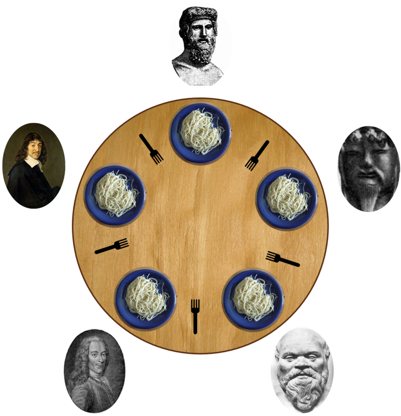
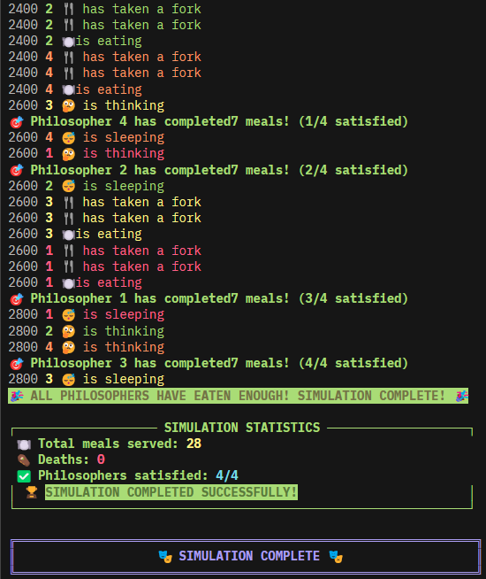
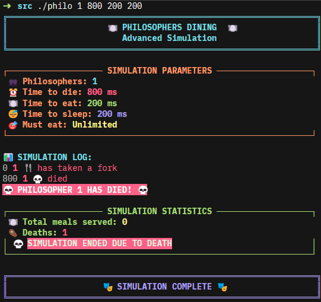
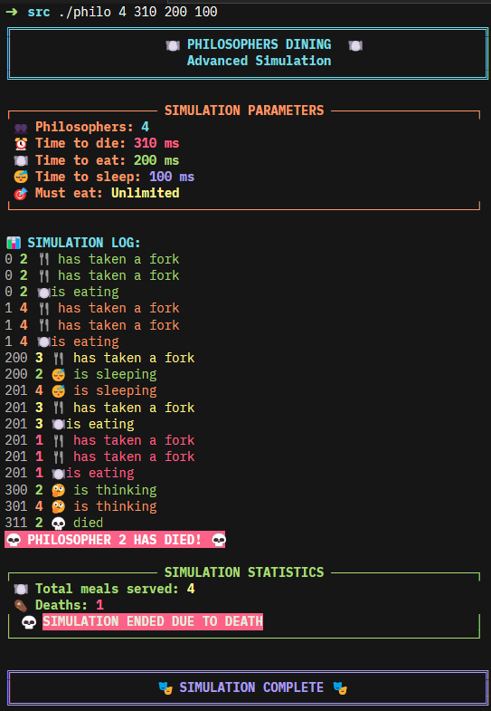

# Philosophers

### A Multithreaded Simulation of Dijkstra's Dining Philosophers Problem

<p align="center">
  
</p>

<p align="center">
  <em>"The formulation of a problem is often more essential than its solution." -- Albert Einstein</em>
</p>

<p align="center">
  
  
  
  
</p>

---

## Table of Contents

- [Foreword](#foreword)
- [The Problem](#the-problem)
- [How the Simulation Works](#how-the-simulation-works)
- [Architecture](#architecture)
- [In-Depth: Low-Level and Hardware Concepts](#in-depth-low-level-and-hardware-concepts)
  - [POSIX Threads and CPU Scheduling](#posix-threads-and-cpu-scheduling)
  - [Mutexes and Atomic Hardware Instructions](#mutexes-and-atomic-hardware-instructions)
  - [Memory Visibility and Cache Coherence](#memory-visibility-and-cache-coherence)
  - [Deadlock Prevention Through Resource Ordering](#deadlock-prevention-through-resource-ordering)
  - [Starvation Avoidance](#starvation-avoidance)
  - [Precise Timing via Busy-Wait Spin Loops](#precise-timing-via-busy-wait-spin-loops)
  - [System Clocks and the Time Stamp Counter](#system-clocks-and-the-time-stamp-counter)
- [Building](#building)
- [Usage](#usage)
- [Demonstration](#demonstration)
- [Project Structure](#project-structure)
- [References](#references)

---

## Foreword

In 1965, [Edsger W. Dijkstra](https://en.wikipedia.org/wiki/Edsger_W._Dijkstra) introduced the Dining Philosophers problem as an examination exercise for students at the Technische Hogeschool Eindhoven. What appeared to be a simple riddle about philosophers and forks became one of the foundational problems in the study of [concurrent computing](https://en.wikipedia.org/wiki/Concurrent_computing) -- a domain where multiple computations execute during overlapping time periods, competing for shared resources, and where the correctness of a program depends not only on what is computed, but on when and in what order.

This project is a from-scratch implementation in C, using nothing beyond the [POSIX threads](https://en.wikipedia.org/wiki/Pthreads) API and standard system calls. Every thread, every mutex, every microsecond of timing is managed explicitly. There are no high-level abstractions hiding the machinery. What you see is what the hardware executes.

---

## The Problem

A fixed number of philosophers sit at a round table. Between each pair of adjacent philosophers lies a single fork. A philosopher spends their life cycling through three states: **thinking**, **eating**, and **sleeping**. To eat, a philosopher must acquire both the fork to their left and the fork to their right. After eating, they put both forks down and sleep. After sleeping, they think, and the cycle repeats.

There is one constraint that makes this non-trivial: if a philosopher does not begin eating within a fixed duration (`time_to_die` milliseconds) since the start of their last meal (or since the simulation began, for the first meal), they die, and the simulation terminates immediately.

The core difficulties that arise from this seemingly simple setup are:

- **[Deadlock](https://en.wikipedia.org/wiki/Deadlock)**: If every philosopher picks up their left fork simultaneously, they all wait forever for the right fork. No progress is ever made.
- **[Starvation](https://en.wikipedia.org/wiki/Starvation_(computer_science))**: Even without deadlock, an unfair scheduling pattern can cause one philosopher to be perpetually denied access to forks while its neighbors eat freely.
- **[Race conditions](https://en.wikipedia.org/wiki/Race_condition)**: When multiple threads read and write shared memory (timestamps, counters, status flags) without synchronization, the program's behavior becomes undefined -- not just incorrect, but unpredictable at the hardware level.

This implementation resolves all three failure modes.

---

## How the Simulation Works

1. **Initialization.** The program parses command-line arguments, validates all values, and allocates shared data structures: an array of philosopher records, one [mutex](https://en.wikipedia.org/wiki/Mutual_exclusion) per fork, a data-protection mutex, and a print-serialization mutex.

2. **Thread creation.** One [POSIX thread](https://man7.org/linux/man-pages/man3/pthread_create.3.html) is spawned for each philosopher. Each thread enters an independent loop: acquire two forks, eat, release forks, sleep, think, repeat. Threads are staggered at startup to prevent initial contention.

3. **Monitoring.** A dedicated monitor thread runs concurrently, scanning every philosopher at sub-millisecond intervals. If any philosopher's elapsed time since their last meal exceeds `time_to_die`, the monitor declares death and halts the simulation. If all philosophers have reached the optional meal target, it declares success.

4. **Synchronization.** Every access to shared state -- last meal timestamps, meal counters, simulation flags -- is wrapped in `pthread_mutex_lock` / `pthread_mutex_unlock` pairs. Print output is serialized through its own mutex to prevent interleaved terminal writes.

5. **Termination.** All philosopher threads are [joined](https://man7.org/linux/man-pages/man3/pthread_join.3.html). The monitor thread is joined. All mutexes are destroyed via [`pthread_mutex_destroy`](https://man7.org/linux/man-pages/man3/pthread_mutex_destroy.3p.html). All heap memory is freed. The program exits cleanly.

---

## Architecture

```
.
├── imgs/                          Demonstration images and GIF
├── src/
│   ├── main.c                     Entry point: init, launch, join, cleanup
│   ├── philo.h                    Type definitions and function prototypes
│   ├── Makefile                   Build rules (cc, -Wall -Wextra -Werror -pthread)
│   ├── args/
│   │   ├── args_1.c               Argument validation, data init, memory allocation
│   │   └── args_2.c               Safe string-to-integer with overflow protection
│   ├── monitor/
│   │   └── monitor.c              Death detection and meal completion monitoring
│   ├── print/
│   │   ├── print_1.c              Thread-safe action logger and statistics renderer
│   │   └── print_2.c              Banner, parameter display, and footer
│   ├── routine/
│   │   ├── routine_1.c            Core philosopher loop: eat, sleep, think cycle
│   │   ├── routine_2.c            Thread creation and joining
│   │   └── routine_3.c            Fork acquisition/release, single-philo case, meal logic
│   └── time/
│       └── time.c                 Millisecond clock and busy-wait precision sleep
└── Philosophers.pdf               Subject specification
```

---

## In-Depth: Low-Level and Hardware Concepts

The following sections describe what actually happens beneath the source code -- at the operating system, CPU, and hardware level -- when this program runs.

---

### POSIX Threads and CPU Scheduling

Each philosopher is a [POSIX thread](https://en.wikipedia.org/wiki/Pthreads) (`pthread_t`) created via [`pthread_create`](https://man7.org/linux/man-pages/man3/pthread_create.3.html). At the operating system level, a thread is the smallest unit of execution that the kernel's [scheduler](https://en.wikipedia.org/wiki/Scheduling_(computing)) can dispatch to a CPU core.

On a modern multicore processor, multiple threads execute **truly simultaneously** -- one per physical (or logical, in the case of [SMT/Hyper-Threading](https://en.wikipedia.org/wiki/Hyper-threading)) core. On a single-core machine, the kernel interleaves threads through [preemptive multitasking](https://en.wikipedia.org/wiki/Preemption_(computing)#Preemptive_multitasking): a hardware timer interrupt fires at regular intervals (typically every 1--10 ms, configurable via the kernel's `HZ` or `tickless` settings), and the scheduler's interrupt handler decides whether to continue the current thread or switch to another.

A [context switch](https://en.wikipedia.org/wiki/Context_switch) involves:
1. Saving the running thread's entire register file -- program counter, stack pointer, general-purpose registers, floating-point/SIMD state, and any thread-local storage pointer -- into a kernel structure called the [thread control block](https://en.wikipedia.org/wiki/Thread_control_block) (TCB).
2. Loading the saved register state of the next thread from its TCB.
3. Flushing or tagging [TLB](https://en.wikipedia.org/wiki/Translation_lookaside_buffer) entries if transitioning between address spaces (not applicable here, since all threads share the same virtual address space within a single process).

The cost of a context switch is on the order of 1--10 microseconds on modern hardware, depending on cache warmth and whether floating-point state must be saved. Linux uses the [Completely Fair Scheduler](https://en.wikipedia.org/wiki/Completely_Fair_Scheduler) (CFS) by default, which models each thread's virtual runtime and always dispatches the thread with the smallest accumulated runtime, ensuring statistical fairness.

In this program, every philosopher thread has its own stack and local variables but shares the heap-allocated `t_data` structure. This shared memory is where synchronization becomes critical.

---

### Mutexes and Atomic Hardware Instructions

A [mutex](https://en.wikipedia.org/wiki/Mutual_exclusion) (`pthread_mutex_t`) provides mutual exclusion. When a thread calls [`pthread_mutex_lock`](https://man7.org/linux/man-pages/man3/pthread_mutex_lock.3p.html), it attempts to acquire exclusive ownership. If another thread already holds the lock, the caller **blocks**: the kernel removes it from the CPU's run queue and places it on a wait queue associated with that mutex. When the owning thread calls [`pthread_mutex_unlock`](https://man7.org/linux/man-pages/man3/pthread_mutex_lock.3p.html), the kernel wakes one waiting thread and moves it back to the run queue.

The implementation of mutex locking relies on **atomic [compare-and-swap](https://en.wikipedia.org/wiki/Compare-and-swap) (CAS)** instructions provided directly by the CPU's instruction set architecture:

- **x86/x86-64**: The [`LOCK CMPXCHG`](https://www.felixcloutier.com/x86/cmpxchg) instruction performs a read-modify-write cycle on a memory location while asserting the processor's `LOCK#` signal on the memory bus (or, on modern CPUs, locking the relevant cache line). This prevents any other core from accessing that cache line for the duration of the operation, guaranteeing [atomicity](https://en.wikipedia.org/wiki/Linearizability) even across cores.

- **ARM (ARMv7 and later)**: The [`LDREX`/`STREX`](https://developer.arm.com/documentation/dht0008/a/ch01s02s01) (load-exclusive / store-exclusive) instruction pair uses the cache coherence protocol's exclusive state to detect contention. If another core modifies the target memory between the `LDREX` and `STREX`, the store fails, and the thread retries in a loop.

- **On Linux**, the fast path of a mutex uses the [`futex`](https://en.wikipedia.org/wiki/Futex) (fast userspace mutex) system call. If the lock is uncontended, the entire lock/unlock cycle completes in **userspace** with a single atomic instruction -- no kernel transition at all. Only when contention is detected does the thread enter the kernel to sleep on the futex wait queue.

This program uses three categories of mutexes:

| Mutex | Purpose |
|---|---|
| `fork_mutexes[i]` | One per fork. A philosopher must hold both adjacent fork mutexes to eat. These model the contested physical resources. |
| `data_mutex` | Protects all shared simulation state: `simulation_stop`, `death_occurred`, `last_meal_time`, `meals_eaten`, `satisfied_count`, `total_meals`. |
| `print_mutex` | Serializes `printf` calls. Without this, concurrent writes to `stdout`'s internal buffer would interleave, producing garbled output. |

---

### Memory Visibility and Cache Coherence

On a multicore processor, each core maintains its own [L1 and L2 caches](https://en.wikipedia.org/wiki/CPU_cache). When core 0 writes a value, that write initially lands in core 0's L1 cache. For core 1 to see the updated value, the hardware must propagate the change through the [cache coherence](https://en.wikipedia.org/wiki/Cache_coherence) protocol.

The dominant protocol on x86 systems is [**MESI**](https://en.wikipedia.org/wiki/MESI_protocol) (Modified, Exclusive, Shared, Invalid), which assigns one of four states to each cache line:

| State | Meaning |
|---|---|
| **Modified** | This core has written to the line. It holds the only valid copy. |
| **Exclusive** | This core holds the only copy, but it has not been modified. |
| **Shared** | Multiple cores hold copies. All copies match main memory. |
| **Invalid** | The line is stale. A read will trigger a cache miss. |

When core 0 writes to a cache line that core 1 holds in `Shared` state, core 0's write triggers an **invalidation message** on the [interconnect](https://en.wikipedia.org/wiki/Bus_snooping) (or snoop bus). Core 1 marks its copy as `Invalid`. The next time core 1 reads that address, it misses in cache, fetches the updated line from core 0 (via cache-to-cache transfer) or main memory, and sees the new value.

**Why this matters for this program**: Mutexes serve as [**memory barriers**](https://en.wikipedia.org/wiki/Memory_barrier) (also called memory fences). The POSIX specification [guarantees](https://pubs.opengroup.org/onlinepubs/9699919799/basedefs/V1_chap04.html#tag_04_11) that:
- `pthread_mutex_lock` issues an **acquire barrier**: all loads after the lock see the most recent writes from any core that previously held the lock.
- `pthread_mutex_unlock` issues a **release barrier**: all stores before the unlock are visible to any core that subsequently acquires the lock.

Without these barriers, a compiler or CPU could reorder memory operations across the lock boundary, and a thread might operate on stale cached data indefinitely. This is why every access to `simulation_stop`, `last_meal_time`, and other shared fields in this codebase is enclosed within `pthread_mutex_lock` / `pthread_mutex_unlock` pairs. The protection is not only against concurrent writes -- it is a guarantee of **visibility** through the hardware cache hierarchy.

---

### Deadlock Prevention Through Resource Ordering

[Deadlock](https://en.wikipedia.org/wiki/Deadlock) occurs when a set of threads forms a circular chain: each holds one resource and waits for another resource held by the next thread in the chain. In the Dining Philosophers problem, the naive approach -- "pick up left fork, then right fork" -- creates exactly this cycle when all philosophers act simultaneously.

The four [Coffman conditions](https://en.wikipedia.org/wiki/Deadlock#Necessary_conditions), all of which must hold simultaneously for deadlock to occur, are:

1. **Mutual exclusion** -- each fork can be held by at most one philosopher.
2. **Hold and wait** -- a philosopher holds one fork while waiting for another.
3. **No preemption** -- a fork cannot be forcibly taken from a philosopher.
4. **Circular wait** -- a cycle exists in the wait-for graph.

This implementation **breaks condition 4** (circular wait) using a resource ordering strategy:

- **Even-numbered philosophers** acquire `left_fork` first, then `right_fork`.
- **Odd-numbered philosophers** acquire `right_fork` first, then `left_fork`.

This imposes a [partial order](https://en.wikipedia.org/wiki/Partially_ordered_set) on resource acquisition. Because not all threads acquire forks in the same rotational direction around the table, a complete cycle in the wait-for graph is structurally impossible. At least one philosopher in any contending set will always be able to acquire both forks, eat, and release them, breaking any potential chain.

Additionally, for odd philosopher counts, the last philosopher receives an extra initial delay (`usleep(2000)`) to further stagger the startup pattern and prevent timing-based collisions at the boundary.

---

### Starvation Avoidance

Even in a deadlock-free system, [starvation](https://en.wikipedia.org/wiki/Starvation_(computer_science)) can occur if the scheduling pattern perpetually favors certain threads. This implementation mitigates starvation through several coordinated mechanisms:

- **Staggered thread startup.** Even-ID philosophers delay 1 ms before entering the main loop. Odd-ID philosophers delay 0.1 ms. For odd philosopher counts, the last philosopher delays 2 ms. This distributes the initial wave of fork acquisition evenly, preventing a [thundering herd](https://en.wikipedia.org/wiki/Thundering_herd_problem) scenario.

- **Post-think micro-delays.** After the think phase, each philosopher calls `usleep` (500 us for odd counts, 100 us for even counts). This briefly yields the CPU via a kernel scheduling point, giving neighboring threads an opportunity to acquire forks.

- **High-frequency monitoring.** The death monitor scans philosopher states every 100 microseconds -- fast enough to detect death within the required tolerance, but not so aggressively as to saturate the `data_mutex` with lock contention.

---

### Precise Timing via Busy-Wait Spin Loops

The `sleep_precise` function implements a [busy-wait](https://en.wikipedia.org/wiki/Busy_waiting) (spin loop) for accurate timing:

```c
void sleep_precise(long long milliseconds)
{
    long long start = get_time_ms();
    while ((get_time_ms() - start) < milliseconds)
        usleep(100);
}
```

Standard kernel sleep functions ([`usleep`](https://man7.org/linux/man-pages/man3/usleep.3.html), [`nanosleep`](https://man7.org/linux/man-pages/man2/nanosleep.2.html)) request the scheduler to suspend the calling thread for *at least* the specified duration. The actual wake-up time depends on scheduler latency, [timer resolution](https://en.wikipedia.org/wiki/Jiffy_(time)), and system load. On a busy system, a `usleep(200000)` (200 ms) call might not return for 210 ms or more.

The busy-wait approach solves this by polling the current time repeatedly and only exiting when the target duration has truly elapsed. The `usleep(100)` inside the loop is a deliberate compromise:
- It **yields the CPU** on each iteration, preventing the thread from consuming 100% of a core.
- It maintains **sub-millisecond accuracy**, since each `usleep(100)` resumes within roughly 100--200 microseconds.
- Each iteration triggers a brief kernel entry, during which the scheduler may dispatch another thread, ensuring cooperative behavior.

---

### System Clocks and the Time Stamp Counter

Time measurement uses [`gettimeofday`](https://man7.org/linux/man-pages/man2/gettimeofday.2.html), which reads the system's wall-clock time with microsecond resolution.

On x86 processors, the underlying hardware clock is the [**TSC (Time Stamp Counter)**](https://en.wikipedia.org/wiki/Time_Stamp_Counter) -- a 64-bit register (`IA32_TSC`) that increments at a fixed rate tied to the processor's base or reference clock frequency. On modern CPUs with an "invariant TSC" (constant-rate TSC), this frequency is independent of power states and dynamic frequency scaling, making it a reliable monotonic time source.

The Linux kernel exposes TSC-based time to user-space processes through the [**vDSO (virtual Dynamic Shared Object)**](https://en.wikipedia.org/wiki/VDSO) -- a small shared library mapped into every process's address space by the kernel. Functions like `gettimeofday` and `clock_gettime` are implemented inside the vDSO so that they **bypass the kernel entirely**: the function reads the TSC via the `RDTSC` or `RDTSCP` instruction (which executes in a few nanoseconds), applies a precomputed scaling factor from the vDSO data page, and returns the result -- all without a [system call](https://en.wikipedia.org/wiki/System_call) or context switch. This makes the busy-wait loop in `sleep_precise` efficient despite its high call frequency.

---

## Building

Requires a POSIX-compliant system (Linux, macOS) with `cc` (or `gcc` / `clang`) and `make`.

```sh
cd src
make        # Build the executable
make clean  # Remove object files
make fclean # Remove object files and the executable
make re     # Full rebuild (fclean + all)
```

The binary is produced as `src/philo`.

---

## Usage

```
./philo number_of_philosophers time_to_die time_to_eat time_to_sleep [number_of_times_each_philosopher_must_eat]
```

| Argument | Description |
|---|---|
| `number_of_philosophers` | The number of philosophers (and forks) seated at the table. Must be a positive integer. |
| `time_to_die` (ms) | Maximum time in milliseconds a philosopher can go without eating before dying. |
| `time_to_eat` (ms) | Duration in milliseconds that eating takes. The philosopher holds two forks for this entire period. |
| `time_to_sleep` (ms) | Duration in milliseconds that sleeping takes. |
| `number_of_times_each_philosopher_must_eat` | Optional. The simulation stops successfully when every philosopher has eaten at least this many meals. |

All values must be positive integers within the range of a 32-bit signed integer.

---

## Demonstration

### Program in Action

<p align="center">
  
</p>

---

### Each Philosopher Eats 7 Times -- Successful Completion

```sh
./philo 4 410 200 200 7
```

<p align="center">
  
</p>

All four philosophers reach the required meal count. The simulation terminates gracefully with zero deaths.

---

### A Philosopher Dies -- Single Fork, No Escape

```sh
./philo 1 800 200 200
```

<p align="center">
  
</p>

With only one philosopher and one fork, eating requires two forks, which is impossible. The philosopher dies exactly at `time_to_die`.

---

### Tight Timing -- Death Under Pressure

```sh
./philo 4 310 200 100
```

<p align="center">
  
</p>

When `time_to_die` barely exceeds `time_to_eat`, any scheduling delay is fatal. The monitor detects and reports death within milliseconds of the deadline.

---

## Project Structure

| File | Responsibility |
|---|---|
| `src/main.c` | Program entry point. Orchestrates initialization, thread lifecycle, statistics output, and resource cleanup. |
| `src/philo.h` | Central header. Defines `t_data`, `t_philo`, and `t_safe_atoi` structures. Declares all function prototypes. |
| `src/Makefile` | Build system. Compiles with `cc -Wall -Wextra -Werror -pthread`. |
| `src/args/args_1.c` | Parses and validates all arguments. Allocates fork mutexes and the philosopher array. Initializes every field. |
| `src/args/args_2.c` | `safe_atoi` -- converts strings to integers with whitespace handling, sign detection, and overflow protection. |
| `src/monitor/monitor.c` | Monitor thread. Continuously scans for philosopher death and meal-count completion at sub-millisecond intervals. |
| `src/print/print_1.c` | Thread-safe action printer with color-coded, timestamped output. Post-simulation statistics renderer. |
| `src/print/print_2.c` | Decorative banners, simulation parameter display, and footer. |
| `src/routine/routine_1.c` | Core philosopher routine. Manages the eat-sleep-think cycle with stop-condition checks at every transition. |
| `src/routine/routine_2.c` | `create_threads` and `wait_threads` -- spawns and joins all philosopher threads. |
| `src/routine/routine_3.c` | Fork acquisition with deadlock-safe ordering, fork release, single-philosopher edge case, and meal tracking logic. |
| `src/time/time.c` | `get_time_ms` (millisecond clock via `gettimeofday`) and `sleep_precise` (busy-wait loop with `usleep` yielding). |

---

## References

- Dijkstra, E. W. (1971). [*Hierarchical Ordering of Sequential Processes*](https://www.cs.utexas.edu/users/EWD/ewd03xx/EWD310.PDF). Acta Informatica, 1(2), 115--138.
- Coffman, E. G., Elphick, M., & Shoshani, A. (1971). [*System Deadlocks*](https://en.wikipedia.org/wiki/Deadlock#Necessary_conditions). ACM Computing Surveys, 3(2), 67--78.
- Butenhof, D. R. (1997). [*Programming with POSIX Threads*](https://www.oreilly.com/library/view/programming-with-posix/9780768684964/). Addison-Wesley.
- Drepper, U. (2011). [*Futexes Are Tricky*](https://www.akkadia.org/drepper/futex.pdf). Red Hat.
- Intel Corporation. [*Intel 64 and IA-32 Architectures Software Developer's Manual*](https://www.intel.com/content/www/us/en/developer/articles/technical/intel-sdm.html).
- Kerrisk, M. (2010). [*The Linux Programming Interface*](https://man7.org/tlpi/). No Starch Press.
- The Open Group. [*POSIX.1-2017: Threads*](https://pubs.opengroup.org/onlinepubs/9699919799/basedefs/pthread.h.html).
- Linux man-pages project. [`pthread_create(3)`](https://man7.org/linux/man-pages/man3/pthread_create.3.html), [`pthread_mutex_lock(3p)`](https://man7.org/linux/man-pages/man3/pthread_mutex_lock.3p.html), [`futex(2)`](https://man7.org/linux/man-pages/man2/futex.2.html), [`gettimeofday(2)`](https://man7.org/linux/man-pages/man2/gettimeofday.2.html).

---

<p align="center">
  Developed as part of the <a href="https://42.fr">42 school</a> curriculum.
</p>
